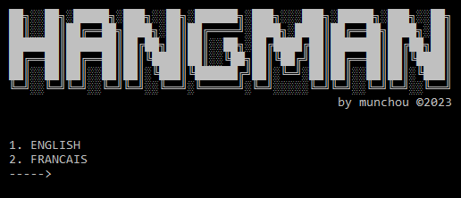
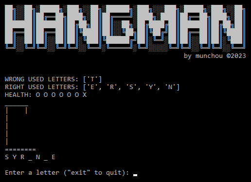
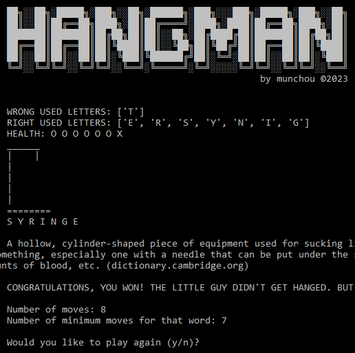
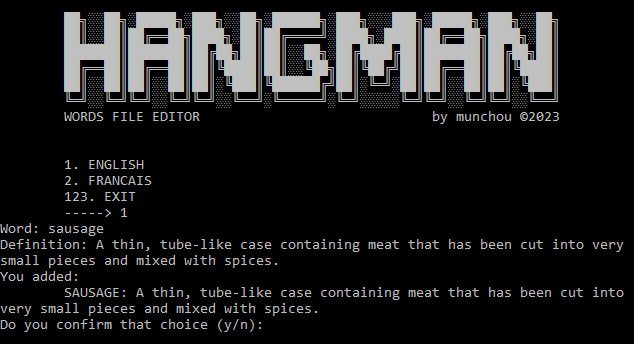

# ABOUT

**HANGMAN GAME**

_Tested with Windows 10 and Python 3.10.2_

_Latest update: 2023, Dec. 12_

# Hao2do (Windows)
### Retrieving a copy of the "depository"

- `git clone https://github.com/munchou/hangman-game.git` (not super necessary but hey, you manage your own soup)

or download the ZIP file and extract it in a chosen folder.

### Starting the game
To run the game, open the "start-game.bat" file or, in your terminal, enter:
- `python main.py`

To add words to the JSON file, you can either directly edit the file or use the program I made for that purpose by opening the "add_a_word.bat" file or by entering:
- `python add_a_word.py`

### Features
- Language choice (English and French, but you can edit the files and add your own).
- "Drawings" of the gallows and stick dude.
- Right/wrong entered letters are displayed (in their respective list).
- Health "bar".
- At the end of a game (either victory or defeat), the definition of the picked word is displayed. Playing is fun, knowledge is essential.

### Updates
- 2023 Dec. 12
WORDS RETRIEVER (separate file - only for English words): instead of entering a word and its definition manually, it is now possible to automatically get one or many words' definitions. 2 options to do so: either you type in word, then add another one (if desired), etc. until you choose not to add, and the program will download the definition(s) from https://dictionary.cambridge.org/us/dictionary/english/. Or you can import a list of words from definitions_retriever/words_to_import.txt, where each words has to be added on a new line. A word that doesn't exist in the database will be skipped.

To add the new words to the game, go through the "add_a_word" program, and instead of adding a word and its definition manually, choose the option "IMPORT ENGLISH WORDS FROM [...]". Upon confirmation, the program will copy the words from the "retriever" to the main words file.

### Some screenshots to show off (NOT up to date yet)

